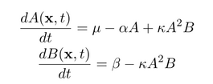
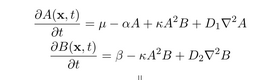
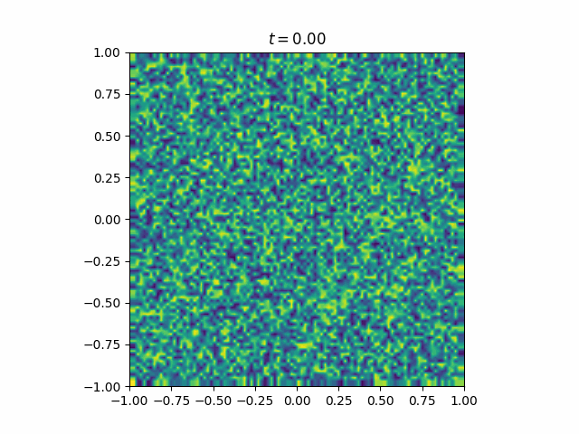
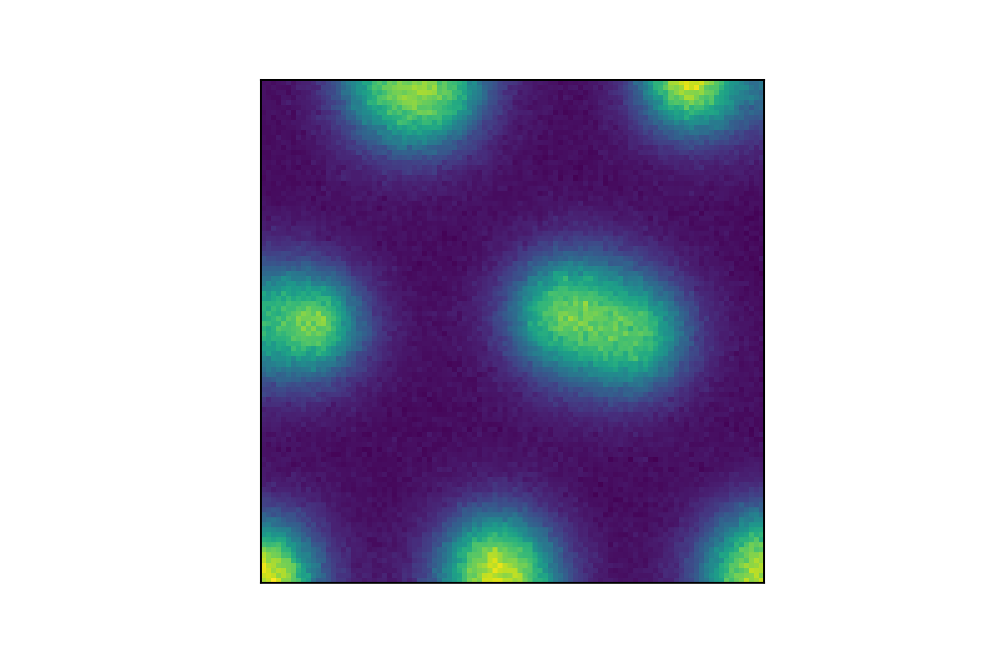
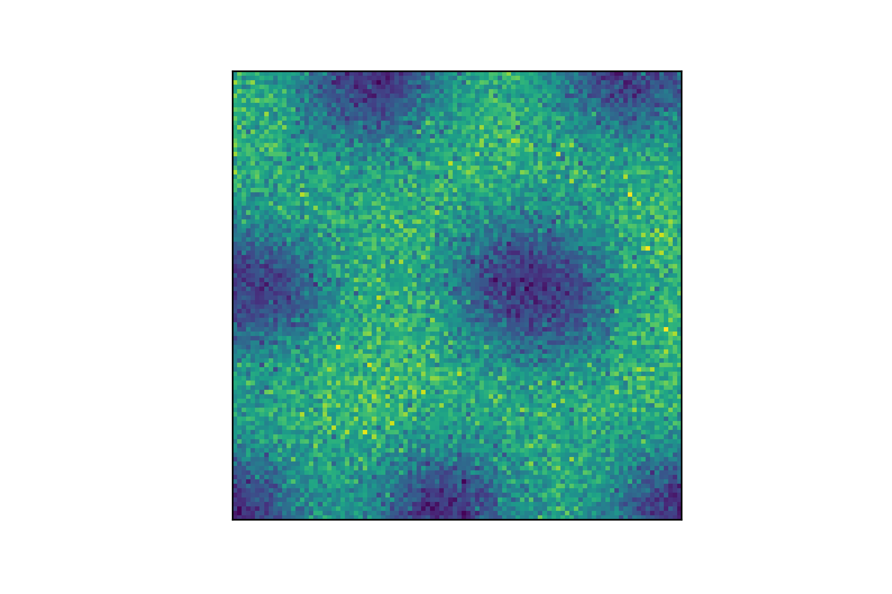

# Schnakenberg_Sim

[](https://opensource.org/licenses/MIT)
[](https://bettercodehub.com/)


This package generates a basic Turing Pattern model using the Schnakenberg System [[1](#references)], as part of a group project for the SABS DTC Mathematical Biology Course.

## Schnakenberg System

We consider a trimolecular reaction that may display limit cycle behaviour:

_2A + B ⇌ 3A_  
_A ⇌ M_  
_N → B_  

M and N are in sufficient excess that their concentration is effectively constant. In addition, the reverse direction in the first reaction occurs far more slowly than the forwards direction, so a simplifying assumption tha tthe reaction in one-directional is taken. We may consider these reactions to be equivalent to standard formation and decay reactions: 

_2A + B → 3A, ∅ → A, A → ∅, ∅ → B_

Which occur with respective rates _k1, k2, k3, k4_.

This can be represented by the non-dimensional system of ODEs:




| Parameter     | Description                                   | Corresponding Stochastic Parameter|
| ------------- | --------------------------------------------- |-----------------------------------|
| μ             | Birth rate of A molcules | k_2 |    
| β             | Birth rate of B molecules   | k_4  |
| κ             | Rate of _2A + B → 3A_  reaction     | k_1 |
| α             | Death rate of A molcules    | k_3  |

β > 0 controls the rate of tranmission, κ > 0 the rate at which exposed individuals become infectious, and γ > 0 the rate at which individuals recover. The model also requires initial conditions for each compartment: S(0), E(0), I(0), and R(0), which represent the initial number of people in each category.


This autocatalytic system is similar to a _'[Brusselator](https://en.wikipedia.org/wiki/Brusselator)'_, in which _B_ is instead formed from _A_ (at some rate _kA_ ).

## Spatial Variation
In order to see any patterning, a spatial component must be taken into account. Turing patterns are driven by an instability causing diffusion mechanism, which needs to be incorporated into the model.

The ODE system therefore becomes the PDE system:



Diffusive terms can be added into the stochastic model by partitioning the domain into boxes of side length _h_. In this model we consider a pseudo-2D domain so arrange our boxes on a 2D rectangular lattice, and index these boxes by _i,j_. Diffusion events are modelled as "reactions" between adjoining boxes:


## Code Structure

Running files have _'main'_ in the file name (such as `ode_main.py`), and can be used to run simulations and generate visualisations of the system, based on functions defined in the other files. The functionality of each of these files is as follows:

* `ode_main.py` - Solve ODE model with no spatial dependance  
* `spatial_main.py` - Solve ODE model with spatial dependance in 1D  
* `spatial_main_2d.py` - Solve ODE model with spatial dependance in 2D  
* `fd_main.py` - Solve ODE model with spatial dependance in 2D, using finite difference method  

Further scripts are provided as Jupyter Notebooks (`.ipynb`) in the `Examples/` directory, and used to generate all other figures in the `Images/` directory.

## Example Results
### Deterministic PDE Simulations
  

This figure displays the formation of a Turing Pattern from a uniform state, with an additional uniform noise distribution. The simulation is nondimensionalised, and so both time and position are in arbitrary units scaled by the rate and diffusion constants.

### Stochastic Simulations


```
import workflow as wf

# workflow.py uses sim.py for simulation and vis.py for visualization

sim_1 = wf.Simulation("sim_1")  # initializes with parameters from sim_1.txt
sim_1.go()  # runs the simulation
sim_1.visualize()  # creates gifs

```

#### Compare final A and B populations


Population A             |  Population B
:-------------------------:|:-------------------------:
 | 


#### CT scan visualization


## References

[1] Schnakenberg, J. (1979). Simple chemical reaction systems with limit cycle behaviour. In Journal of Theoretical Biology (Vol. 81, Issue 3, pp. 389–400). Elsevier BV. https://doi.org/10.1016/0022-5193(79)90042-0
